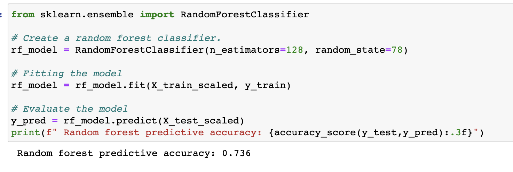

# Predicting_NBA_Outcomes

“I think it’s pretty important that you learn how to keep your own scoreboard and how to be focused on what truly matters over the long term.”
-Sam Hinkie

## Topic
Predicting NBA Game Outcomes
- Utilize data from the National Basketball Association (NBA) 
- Predict: Game outcomes
- Understand:  predictive power of certain features
- Determine:  whether the chosen inputs / features can be used to accurately predict game outcomes

## Purpose 
As a team of NBA fans (and errant gamblers!) we were curious to see if we could figure out a way to predict the impact of player performance and other game features on the outcome of NBA games.

## Resources

### Technology

- Software: Anaconda 4.9.2, Jupyter Notebook 6.0.3 , Python 3.7.6, PostgreSQL, PGAdmin4
- Data Warehouse:  AWS
- Using: Pandas, NumPy, SQLalchemy extensions and functions
- Algorithms: Random Forest, Logistic Regression

### Source Data Description

- Kaggle: NBA game data 2004 - 2020
- Original Source:  https://www.nba.com/stats/
- NBA API:  https://pypi.org/project/nba-api/ 
- Kaggle Source:  https://www.kaggle.com/nathanlauga/nba-games
- Data files used: 
    - Games.csv
    - Games_details.csv
    - Players.csv
    - Ranking.csv
    - teams.csv

## Research Questions

- Which features are important to determine game outcomes?
- How will team outcomes by season be determined by team metrics? (points, assists, steals, blocks, rebounds)?
- Does the factor of Home vs Visitor team have an impact on game outcome?
- Are there other team factors that determine game outcomes?
- Which models best predict performance?

## Data Exploration

### Data Cleaning

Data Cleaning Process Entailed:
  - Removal of NaN values
  - Removal of Null values
  - Identifying data types
  - Retaining columns that could provide features of interest
  - Dropping  redundant columns
  - Dropping columns that would not be pertinent to answering our questions of the data or that proved problematic for the model
  - Transform data set into Home & Visitor team stats
  - Identifying and removal of duplicates (i.e. duplicates removed from datafiles then checked once in database leading to additional removals)
  - Ensured dummy variables for any columns with non-numeric values (i.e. team name) 
  - Utilized OneHotEncoder then merged the variables to the dataframe

Data preprocessing
- We decided to aggregate game-level data into averages by using groupby statements on Season_ID and Team_ID. We took average stats for both home and away teams
- Average offensive stats
    - total points
    - 2 pt field goals made, attempted, and percentage made
    - 3 pt field goals made, attempted, and percentage made
    - free throws attempted, and percentage made
    - assists
- Average defensive stats
    - Offensive rebounds
    - Defensive rebounds
    - Steals
    - Blocks
- Average team performance stats
    - Turnovers
    - Personal Fouls
- Team factors
    - Team name
    - Away team or Home team
    - Conference (Western or Eastern)
    
These average statistics were applied to each game, and team performance stats for individual games were dropped from our dataset. We then trained our model to assess whether or not the home team won

### Data Exploration

- Initial Exploration:  Identifying potential features
    - Started with over 50 columns that could provide features of interest with 2 key prominent identified segments:
        - Offensive Stats
        - Defensive Stats
    - Identifying  redundant columns
        - Data type
        - Duplicate stats/ metrics 
        - Attempt to identify what is causing overfitting of the model
    - Database  relationship mapping 
- Data types in each column across all data sets to ensure data types would work within our model
- Creating: new rows to split out Home / Away and a new column for Team Win / Loss

### ERD Database Relationship Mapping

## Analysis

Analysis to be undertaken: 
  - Created:  relational database of potential features
  - Refinement: identifying which features are causing our model to be overfit (i.e. yielding 98% accuracy)
  - Training: the model removing features that create overfit
  - Continuing to refine feature inputs
  - Testing data with different model options for optimal fit
  - Further exploration / analysis:
  - Regression analysis to assess the validity of features
  - Visualization of correlation between features and outcomes

### Description of the Statistical Analysis

For our initial statistical analysis we ran a multiple regression model on our data. For this we first removed any columns or data types that we felt would not effect the outcomes of the games or would create issues in running the regression. From there we used the statsmodels module in Python to get our OLS Regression Results data that gave us all of our statistical data on how the different columns and features related to the outcome of having the Home Team Win. What we found was there was multiple columns that had statistically significant effects on the outcomes of games such as Home Team Points, Away Team FGM, Home Team Rebounds, and Away Team Assists. By running this initial statistical analysis it gave us a good starting point of seeing what features had the most significant impacts on the Home Team Wins.

## Machine Learning Model

### Model Choice
We chose three models to predict performance: linear regression, logistic regression (LR), and a random forest classifier (RFC). We originally built our models by using team performance stats for individual games. However, we found that the RFC accuracy was 99% and the LR accuracy was 57%, so both models were unreliable predictors of performance. The RFC model was overfit because factors such as how many points a team scored easily predicted the outcome, which wouldn't be reliable for future predictions. With this realization, we optimized our model by improving our data pre-processing, and felt greater confidence in our RFC model with an accuracy score of 74% and a logistic regression accuracy score of 67%

### Approach
- Create a classification model to determine game outcome (Win/ Loss)

  - Description of the Model: initially utilizing Random Forest 
    - Staple in machine learning due to robustness and scalability
    - Output and feature selection of Random Forest models easy to interpret
    - Easily handle outliers and non-linear data
    - Easier to use when not utilizing image or natural language
- Started with 50+ potential features (in the process of narrowing)
- Random Forest initial model - likely overfit due to feature choices 
- Evolution of model:  started with Random Forest and tested out a Logistic Regression model in parallel.  
    - Random Forest when refined provided 73.6% accuracy 
    - Logistic Regression provided 67% accuracy

### Machine Learning Process Detail
- Description of data pre-processing:  
    - As detailed in Data cleaning and exploration
    - Game level data needed to be averaged and aggregated for an entire team over a full season
- Feature selection:  
    - Offensive stats
    - Defensive stats
    - Team name
- How data was split into training & testing sets:
    - Home Team Win “outcome”
    - 75% / 25% split
    - Used same “Random State” when testing different models

- Data enhancement for better feature fit creating a more reliable model (i.e. averages by team per season) 

## Presentation Slides

https://docs.google.com/presentation/d/18Ij9W_wmpUUDsM6LSUpxQwxCbR3NeJfk8vHeC7B2Zq4/edit?usp=sharing

## Dashboard Mock Up

https://docs.google.com/presentation/d/103ir_JitNAbp07oyHvgJAFLcFKm4zC7HRJB4_MHrRJg/edit?usp=sharing

## Dashboard

https://public.tableau.com/profile/patricia.chapin#!/vizhome/NBADataAnalysis_16208723719400/NBAStatsDashboard

## Team
- Jerome Simmons
- Patricia Chapin-Bayley
- Praveen Ravi
- Josh Merenstein

